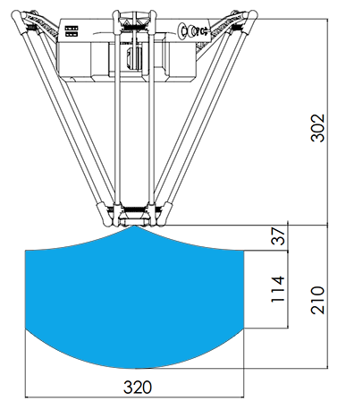
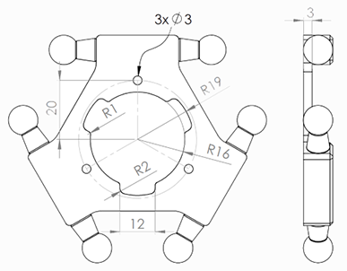

# Delta X 2 Basic Kit

## Cost: 549$ (No Frame) / 649$ (With Frame)

## [Purchase Now](https://deltaxstore.com/products/delta-x-2-basic-kit)

## Components

`Delta X 2 Basic Kit` is a perfect choice for those who starting to learn about Delta Robot. It is a complete kit with all the necessary parts to build a Delta Robot. The kit includes:

* Delta X 2 Robot
* Pen holder & Touch pen
* Power supply (12VDC 5A)
* USB cable
* Aluminum frame (optional)

---

## Basic Paramemters

|Parameters                   | Specifications      |
|-----------------------------|---------------------|
|Working space                |D = 320 mm, H = 200mm|
|Max payload                  |700g                 |
|Max speed                    |800 mm/s             |
|Max accel                    |20000 mm/s2          |
|Pose repeatability           |±0.15 mm             |
|Position accuracy            |±0.15 mm             |
|Number of axes               |3/4                  |
|Power supply                 |12VDC - 5A           |
|Weight                       |4kg                  |

---

## Electrical Parameters

|Components                   | Specifications      |
|-----------------------------|---------------------|
|Controller Board             |Delta X 2 Board (ARM Cortex-M3)|
|Communication                |USB, UART, Bluetooth, Wifi   |
|Input                        |1 analog input(temp sensor)  |
|Output                       |Stepper/Laser/Vacuum/Axis-4/Gripper|

---

## Mechanical materials

|Part                         | Materials           |
|-----------------------------|---------------------|
|Upper Arm                    |Aluminum plate       |
|Lower Arm                    |Carbon fibre tube    |
|Base frame                   |Aluminum profile     |
|Moving base                  |Aluminum             |
|Motor mounted                |Aluminum             |
|Body cover                   |3D printed (PLA)     |

---

## Robot Dimensions

### Working Space

### Safe Working Area

---

### Moving Base Dimensions

