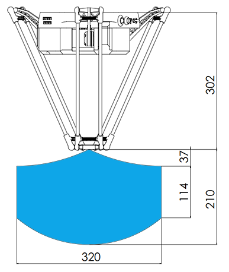
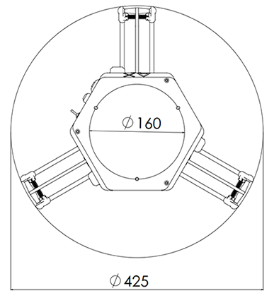
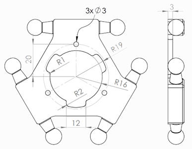

# Delta X 2 Develop Kit

## `Cost`: $1249

`Delta X 2 Develop Kit` provide you all the things you'll need to build an automative station. It's suitable for teaching, research, testing or even a small manufactory line.

---

## Components

Let see what we have in a `Delta X 2 Develop Kit`:

- **Delta X 2 Robot**.
- Axis 4.
- All kind of End Effector:
    - Pen holder & Touch Pen.
    - Single/double Sucction cup & Air Pump.
    - Laser Module.
    - Hard Gripper.
    - Soft Gripper.
    - 3D Printing Kit(Extruder Stepper, Hot End kit, teflon tub).
- Aluminium profile frame (620x480x620mm).
- Slider X.
- Short conveyor.
- Long conveyor.
- Power Supply: 1x 12V-5A, 3x 12V-3A.
- Cables: 1x USB-B Cable, 3x USB to TTL.
- Tool (Hexagon Wrenchs, Bolts, Nuts, Washers, Wire Keepers).

---

## Basic Paramemters

|Parameters                   | Specifications      |
|-----------------------------|---------------------|
|Working space                |D = 320 mm, H = 200mm|
|Max payload                  |700g                 |
|Max speed                    |800 mm/s             |
|Max accel                    |20000 mm/s2          |
|Pose repeatability           |±0.15 mm             |
|Position accuracy            |±0.15 mm             |
|Number of axes               |3/4                  |
|Power supply                 |12VDC - 5A           |
|Weight                       |4kg                  |

---

## Electrical Parameters

|Components                   | Specifications      |
|-----------------------------|---------------------|
|Controller Board             |Delta X 2 Board (ARM Cortex-M3)|
|Communication                |USB, UART, Bluetooth, Wifi   |
|Input                        |1 analog input(temp sensor)  |
|Output                       |Stepper/Laser/Vacuum/Axis-4/Gripper|

---

## Mechanical materials

|Part                         | Materials           |
|-----------------------------|---------------------|
|Upper Arm                    |Aluminum plate       |
|Lower Arm                    |Carbon fibre tube    |
|Base frame                   |Aluminum profile     |
|Moving base                  |Aluminum             |
|Motor mounted                |Aluminum             |
|Body cover                   |3D printed (PLA)     |

---

## Conveyor X Parameters

|Parameters                   | Infors              |
|-----------------------------|---------------------|
|Length                       |500/1000mm (Short/Long)|
|Width                        |120mm                |
|Max speed                    |800 mm/s             |
|Max accel                    |20000 mm/s2          |
|Accuracy                     |±0.15 mm             |
|Connection                   |USB to TTL           |
|Control                      |G-CODES/Potentiometer|
|Power supply                 |12VDC - 3A           |
|Weight                       |2kg                  |

---

## Slider X Parameters

|Parameters                   | Infors              |
|-----------------------------|---------------------|
|Working Length               |300mm                |
|Max speed                    |80 mm/s              |
|Max accel                    |900 mm/s2            |
|Accuracy                     |±0.15 mm             |
|Connection                   |USB to TTL           |
|Control                      |G-CODES/Potentiometer|
|Power supply                 |12VDC - 3A           |
|Weight                       |2kg                  |

---

## Robot Dimensions

### Working Space

### Safe Working Area

---

## Moving Base Dimensions

---

## Video Tutorials

> Watch the video below to know how to assemble `Delta X 2 Develop Kit`.

